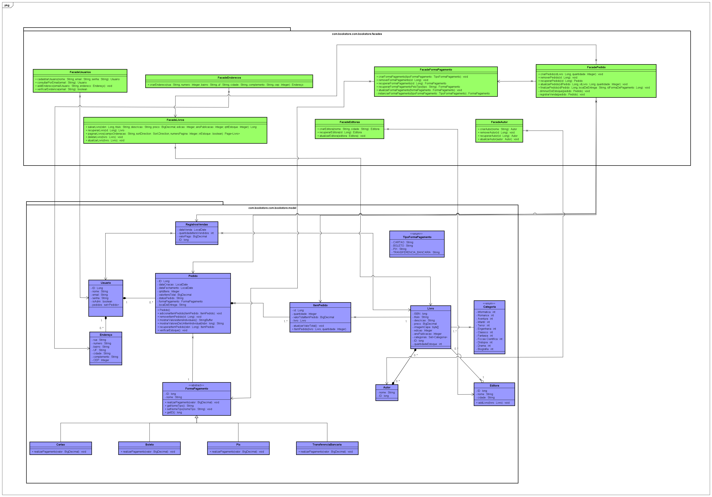

# IFPB - Campus Monteiro
## Projeto da disciplina DAC 2021.1 - Grupo 2
Este é um projeto para um e-commerce de livros desenvolvido pela equipe NPG como requisito para aprovação na disciplina de Desenvolvimento de Aplicações Corporativas 2021.1.

## Diagrama de classes 

## Quem somos?
A NPG é uma equipe de três desenvolvedores de sistemas universitários estudantes do IFPB - Campus Monteiro. A sigla representa a inicial de cada integrante:

<!--ts-->
   * [Nycolas R. Alves](https://github.com/NycolasR)
   * [Pedro Lucas](https://github.com/PedroSCY)
   * [José Gabriel](https://github.com/gsillva18)
<!--te-->

## Tecnologias usadas
### Back end
<!--ts-->
   * [Java 8](https://www.oracle.com/br/java/technologies/javase/javase-jdk8-downloads.html)
   * [Spring Boot](https://spring.io/projects/spring-boot)
   * [Spring Data JPA](https://spring.io/projects/spring-data-jpa)
   * [MySQL](https://www.mysql.com/)
   * [MySQL Workbench 8.0](https://dev.mysql.com/downloads/workbench/)
   * [Maven](https://mvnrepository.com/)
   * [Astah UML](https://astah.net/downloads/)
<!--te-->

## Funcionalidades
### Back end
- [x] CRUD de livros
- [x] CRUD de editoras
- [x] CRUD de endereços
- [x] CRUD de autores
- [x] CRUD de usuários
- [x] CRUD de endereços
- [x] CRUD de pedidos
- [x] CRUD de itens de pedido
- [x] CRUD de registros de pagamento
